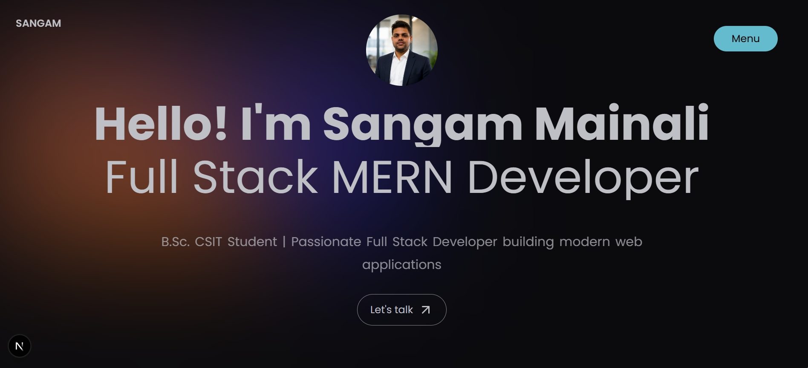

# Portfolio



A modern, responsive portfolio website built with Next.js 16, React 19, and Tailwind CSS. Features smooth animations, project showcases, skills section, contact form, and more.

## Features

- Responsive design optimized for all devices
- Interactive animations using Framer Motion
- SEO optimized with Next.js metadata
- Contact form with email integration
- Project filtering and categorization
- Custom cursor and loader animations
- TypeScript for type safety

## Tech Stack

- **Framework**: Next.js 16
- **UI Library**: React 19
- **Language**: TypeScript
- **Styling**: Tailwind CSS
- **Animations**: Framer Motion, GSAP
- **Icons**: Lucide React, React Icons
- **Email**: Nodemailer

## Getting Started

```bash
git clone https://github.com/sangammainali11/portfolio.git
cd portfolio
npm install
npm run dev
```

Open [http://localhost:3000](http://localhost:3000) in your browser.

## Build

```bash
npm run build
npm start
```

## License

MIT
